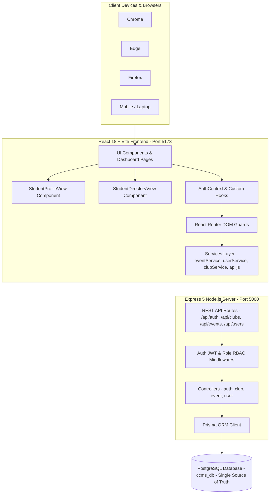

# Centralized Club Management System (CCMS) — Architecture Documentation

## 1. Project Overview

* **Project Name**: Centralized Club Management System (CCMS) / UniClubs Central Portal
* **Purpose**: Digitizes, centralizes, and governs all student club activities, multi-tiered event proposal approvals, attendance tracking via QR codes, certificate generation & issuance, student directories, and student self-profile management across academic departments and university leadership.
* **Main Problems Solved**:
  * Eliminates manual paper-based approval chains for campus events across multiple governance tiers.
  * Standardizes club administration, department oversight, student directories, and activity logs.
  * Provides cryptographic QR-verified certificate issuance for event prize winners using name-only winner selection.
  * Enables secure self-registration and profile management for students with mandatory roll number tracking.
  * Integrates real-time attendance verification with dynamic QR code generation.
  * Ensures complete cross-browser data consistency (Chrome, Edge, Firefox, Mobile) backed by a single authoritative PostgreSQL database.
* **Architecture Style**: Client-Server REST Architecture with PostgreSQL as the **Single Source of Truth** via Express REST API and Prisma ORM.
* **Current Implementation Status**: Fully Functional (Phases 1–5 complete with full PostgreSQL persistence, REST API integration, RBAC authorization, and zero browser-storage database fallbacks).
* **Major Modules**:
  * **User Management & Authentication**: JWT-based auth & RBAC across 4 administrative tiers + Student role.
  * **Student Profile Management**: Dedicated `/student?tab=profile` tab allowing students to update personal and academic details with validation and real-time backend database sync.
  * **Department Student Directory**: HOD and Faculty Incharge department-restricted student management views.
  * **Club Management**: Departmental and college-wide club creation, membership, and coordinator assignments.
  * **Event Governance & Multi-Tier Approvals**: 4-level review pipeline (Coordinator -> Faculty Incharge -> HOD -> DSW) with interactive status badges.
  * **Certificate Management**: Name-only 3-winner selection, 4-step sign-off, visual layout, and PDF export.
  * **Attendance Management**: Event-specific QR code scanning and verification logging.

---

## 2. Tech Stack

| Layer | Technology | Version | Purpose |
| :--- | :--- | :--- | :--- |
| **Frontend Framework** | React | `18.3.1` | Component-driven UI client |
| **Language** | JavaScript (ES6+) / JSX | `ES2022` | Dynamic client and server scripting |
| **Build Tool / Bundler** | Vite | `6.4.3` | Hot module replacement & production bundler |
| **Routing** | React Router DOM | `6.28.0` | Client-side SPA routing & route guards |
| **Icons** | Lucide React | `1.16.0` | Dashboard & UI icon system |
| **Styling** | Native CSS (Modular) | `CSS3` | CSS modules with global design tokens in `index.css` |
| **Backend Runtime** | Node.js | `v18+` | JavaScript server runtime environment |
| **API Framework** | Express | `5.2.1` | HTTP web server & REST API router |
| **ORM** | Prisma ORM | `5.22.0` | Database schema modeling & type-safe queries |
| **Database** | PostgreSQL | `15` | Relational database (`ccms_db`) |
| **Authentication** | JSON Web Tokens (`jsonwebtoken`) | `9.0.3` | Stateless Bearer token authentication |
| **Password Security** | Bcrypt (`bcrypt`) | `6.0.0` | Salted password hash generation |
| **File Upload** | Multer | `2.3.0` | Multipart form-data handling for attachments |
| **PDF Generation** | jsPDF | `4.2.1` | Client-side certificate & notice PDF export |
| **QR Code Engine** | qrcode.react | `4.2.0` | Real-time QR generation for attendance & verification |
| **Containerization** | Docker & Docker Compose | `3.8+` | Container orchestrations for PostgreSQL |

---

## 3. High-Level System Architecture



---

## 4. Architecture Pattern & Design Guarantees

1. **Component-Based Frontend**: Structured with atomic React components (`src/components/common`), specialized view components (`src/components/student/StudentProfileView.jsx`, `src/components/common/StudentDirectoryView.jsx`), and role dashboard orchestrators (`src/pages`), encapsulated with modular CSS.
2. **Single Source of Truth**: All application state (Users, HODs, Faculty, Students, Clubs, Events, Approvals, Attendance, Registrations) resides strictly in PostgreSQL (`ccms_db`).
3. **No Browser-Storage Fallback Database**: Frontend services do not maintain or query local storage as a database fallback. All CRUD actions execute over the Express REST API (`http://localhost:5000/api`).
4. **Backend Role Authorization (RBAC)**: All protected API routes verify JWT Bearer tokens and enforce role-based access control server-side.
5. **Data Persistence Guarantee**: Record deletions or updates performed by authorized users (e.g. DSW deleting a user/club) modify PostgreSQL directly and permanently persist across server restarts, browser refreshes, and different client browsers.

---

## 5. Directory & File Layout

```
centralclubs/
├── architect.md                 # System Architecture & Documentation
├── index.html                   # Entry HTML template
├── package.json                 # Frontend dependencies (React, Vite, jsPDF, Lucide)
├── vite.config.js               # Vite bundler configuration
├── server/
│   ├── .env                     # PORT, DATABASE_URL, JWT_SECRET
│   ├── package.json             # Backend dependencies (Express, Prisma, Bcrypt, JWT)
│   ├── prisma/
│   │   └── schema.prisma        # PostgreSQL Schema Definition
│   └── src/
│       ├── index.js             # Express Server entrypoint (Port 5000)
│       ├── seed.js              # One-time database seed script
│       ├── controllers/         # auth, club, event, user controllers
│       ├── middlewares/         # auth & authorize middleware
│       └── routes/              # auth, club, event, user REST routes
└── src/
    ├── constants/               # Roles, event statuses, departments
    ├── context/                 # AuthContext (JWT session restoration)
    ├── data/                    # Initial constants
    ├── pages/                   # DSW, HOD, Faculty, Student dashboards & Login
    └── services/                # api.js, authService, userService, clubService, eventService
```
